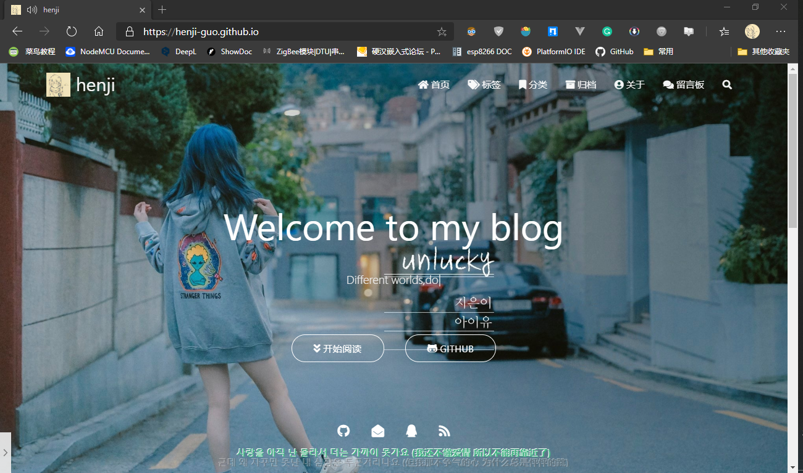

# Blog-source-code

博客源代码
An open source blog source code

# Example

博客效果如下：
[henji-guo.github.io](https://henji-guo.github.io)



# how to use 

1. 初始化hexo

```bash 
hexo init <文件名> 
```

2. 安装npm

```bash 
npm install
```
3. 拉取本仓库

```bash 
git clone https://github.com/henji-Guo/Blog-source-code.git
```
4. 替换文件

- scaffolds
- source
- themes
- package(不是必须，主要版本问题新版5.0.0+ hexo的跟代码高亮冲突，建议修改4.x.x)
- 一键部署.bat Windows脚本(hexo clean && hexo g && hexo d)
  
5. 修改_config.yml

大部分已经修改了好了,主要修改链接,图片,菜单以及部署相关链接

本博客的主题采用的是[hexo-themes-matery](https://github.com/blinkfox/hexo-theme-matery)

具体修改参考 [README_CN](https://github.com/blinkfox/hexo-theme-matery/blob/develop/README_CN.md)


   


